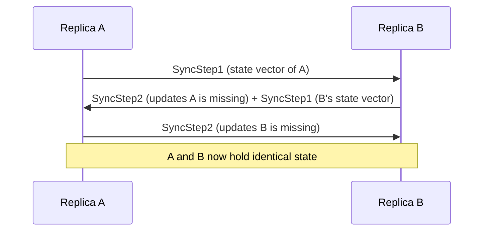
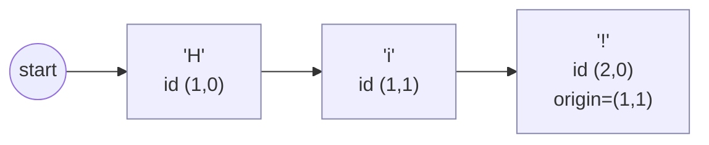
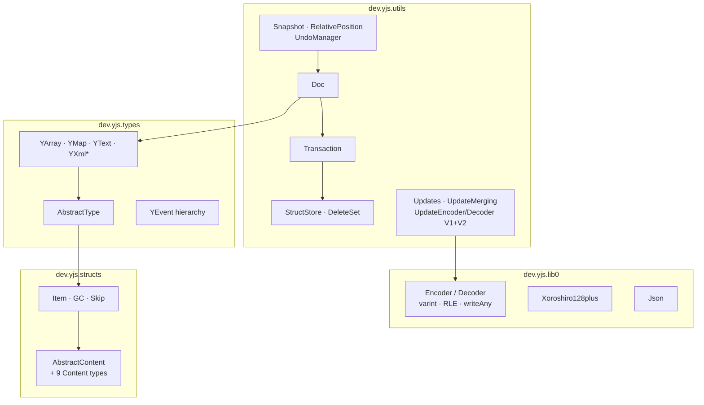

# yjs-java

A faithful Java port of [**Yjs**](https://github.com/yjs/yjs) (v13.6.31) — the high‑performance
CRDT framework that powers real‑time collaboration in apps like editors, whiteboards, and
multiplayer tools — together with the parts of [**lib0**](https://github.com/dmonad/lib0) (v0.2.99)
that Yjs needs.

> **It speaks Yjs's wire format byte‑for‑byte.** Updates produced by this library are *binary‑identical*
> to Yjs's, and updates produced by Yjs (any 13.x) can be applied here. A JVM service can join the
> same collaborative session as browser clients and sync over the exact same messages — verified
> against `yjs@13.6.31` from npm and against historical documents from `yjs@13.2.0`.

---

## What it does

Yjs (and this port) is a **CRDT** — a *Conflict‑free Replicated Data Type*. It lets many users (or
servers) edit a shared document **at the same time, even while offline**, and guarantees that once
everyone has exchanged their changes, **every replica ends up identical** — with no central
coordinator, no locks, and no merge conflicts.

You work with familiar shared data types:

| Type | Java class | Like… |
| --- | --- | --- |
| **Map** | `YMap` | a `Map<String, Object>` (last‑writer‑wins per key) |
| **Array** | `YArray` | a `List<Object>` |
| **Text** | `YText` | a rich‑text string with formatting + embeds (deltas) |
| **XML** | `YXmlFragment` / `YXmlElement` / `YXmlText` / `YXmlHook` | a DOM‑like tree |

Each replica makes changes locally and emits a compact **binary update**. You ship that update to
other replicas (over WebSocket, HTTP, a message bus, a file — your choice), apply it, and the
documents converge. The merge is automatic and deterministic.

```mermaid
flowchart LR
    subgraph Client A (browser, yjs)
      A[Y.Doc]
    end
    subgraph Server (JVM, yjs-java)
      B[Doc]
    end
    subgraph Client C (browser, yjs)
      C[Y.Doc]
    end
    A -- binary update --> B
    B -- binary update --> A
    B -- binary update --> C
    C -- binary update --> B
    A -. converges .- B
    B -. converges .- C
```

Because the binary format is identical, **A, B and C can be any mix of Yjs and yjs‑java**.

---

## When to use it

Reach for a CRDT when multiple parties change the same state concurrently and you need them to
agree without a single source of truth blocking writes. Typical Yjs use cases — all of which this
port supports on the JVM:

- **Collaborative editing** — Google‑Docs‑style text/rich‑text, code editors, comments.
- **Real‑time multiplayer** — whiteboards, design tools, dashboards, shared cursors/state.
- **Offline‑first / local‑first apps** — edit offline, sync later; no "your copy is out of date".
- **Multi‑device sync** — the same user on phone + laptop, merged automatically.
- **Server‑side participation** — a JVM backend that validates, persists, indexes, or transforms a
  shared document while staying in the same Yjs session as the clients (e.g. authoritative
  persistence, server‑side rendering of a collaborative doc, bots/agents that edit documents).
- **Backend ↔ browser bridges** — terminate `y-websocket`/`y-webrtc` traffic on the JVM, or store
  and relay Yjs updates from Java services.

If your state has a single writer, or a database transaction is the natural source of truth, you
probably don't need a CRDT. CRDTs shine when *everyone writes* and *no one should wait*.

---

## Install & build

Requires **JDK 21+** and Maven. Clone and build:

```bash
mvn test          # build + run the full test suite
mvn -q package    # build the jar (target/yjs-java-0.1.0-SNAPSHOT.jar)
```

(Artifacts are not yet published to Maven Central; install locally with `mvn install` and depend on
`dev.yjs:yjs-java:0.1.0-SNAPSHOT`.)

---

## Quick start

```java
import dev.yjs.utils.Doc;
import dev.yjs.utils.Updates;
import dev.yjs.types.YArray;
import java.util.List;

Doc d1 = new Doc();
d1.getArray("todos").insert(0, List.of("buy milk", "walk dog"));

// Produce a Yjs-compatible binary update and apply it on another replica
byte[] update = Updates.encodeStateAsUpdate(d1);

Doc d2 = new Doc();
Updates.applyUpdate(d2, update);

System.out.println(d2.<Object>getArray("todos").toJSON()); // [buy milk, walk dog]
```

### Map, Array, Text

```java
Doc doc = new Doc();

// YMap — last-writer-wins per key
YMap<Object> map = doc.getMap("state");
map.set("count", 1L);
map.set("title", "hello");
map.get("count");          // 1L
map.has("title");          // true

// YArray
YArray<Object> arr = doc.getArray("list");
arr.insert(0, List.of(1L, 2L, 3L));
arr.delete(1, 1);          // -> [1, 3]
arr.push(List.of("end"));  // -> [1, 3, "end"]

// YText — collaborative (rich) text
YText text = doc.getText("body");
text.insert(0, "Hello world");
text.format(0, 5, Map.of("bold", true));     // bold "Hello"
text.toDelta();   // [{insert:"Hello", attributes:{bold:true}}, {insert:" world"}]
text.toString();  // "Hello world"
```

### Nesting types

`YMap`/`YArray` values can themselves be shared types, forming a deep collaborative tree:

```java
YMap<Object> root = doc.getMap("doc");
YArray<Object> comments = new YArray<>();
root.set("comments", comments);              // attach, then edit
comments.push(List.of("first!"));
root.toJSON();                               // {comments=[first!]}
```

### Two‑way sync with state vectors (only send what's missing)

A **state vector** is a tiny summary of "what I already have". Send it to a peer and they reply
with *only the operations you're missing*:

```java
// d2 tells d1 what it has; d1 sends back just the delta
byte[] sv2 = Updates.encodeStateVector(d2);
byte[] missing = Updates.encodeStateAsUpdate(d1, sv2);
Updates.applyUpdate(d2, missing);
```



This handshake is the `y-protocols` *sync protocol*; a JVM `Doc` can drive it directly.

### Observing changes

```java
YArray<Object> arr = doc.getArray("list");
arr.observe((event, transaction) -> {
    // event.delta() => [{retain:1},{insert:[...]},{delete:1}]
    System.out.println(arr.toJSON());
});
arr.observeDeep((events, transaction) -> { /* fires for nested changes too */ });
```

### Undo / redo

```java
import dev.yjs.utils.UndoManager;

YText text = doc.getText("body");
UndoManager um = new UndoManager(text);
text.insert(0, "draft");
um.undo();   // removes "draft"
um.redo();   // puts it back
```

### Snapshots & time travel (requires `gc=false`)

```java
import dev.yjs.utils.Snapshot;

Doc doc = new Doc(new Doc.Options().gc(false));
YText t = doc.getText("t");
t.insert(0, "v1");
Snapshot snap = Snapshot.snapshot(doc);   // mark a point in history
t.insert(2, " v2");
t.toDelta(snap);                          // render the document as of `snap`
```

### Sub‑documents

```java
Doc parent = new Doc();
Doc child  = new Doc();
parent.getMap("docs").set("child", child);   // child syncs as a nested subdocument
```

---

## How the CRDT works (the short version)

Everything is squeezed into **one list** so a single conflict‑resolution algorithm
([YATA](https://www.researchgate.net/publication/310212186)) can handle every type:

- An **Array** is a list of items.
- **Text** is a list of characters (runs of characters share one node).
- A **Map** is a list of entries; the latest entry per key wins.

Each inserted item carries a unique **ID `(client, clock)`** and remembers the IDs of its original
left/right neighbours (`origin` / `rightOrigin`). When two clients insert at the same spot, every
replica orders them the same way using those origins plus the client id as a deterministic
tie‑breaker — so all replicas converge **without** communication.



Deletions are tracked separately as a compact **delete set** (runs of deleted ids), and deleted
content is garbage‑collected. Updates and state vectors are serialized with a dense
variable‑length binary encoding (this is what makes Yjs fast and small on the wire).

See [`PORTING_NOTES.md`](./PORTING_NOTES.md) and Yjs's own
[`INTERNALS.md`](https://github.com/yjs/yjs/blob/main/INTERNALS.md) for the gory details.

---

## Architecture



| Package | Responsibility |
| --- | --- |
| `dev.yjs.lib0` | binary encode/decode, `Json`, `Observable`, deterministic PRNG |
| `dev.yjs.structs` | the list‑node `Item` (YATA), `GC`/`Skip`, and the 9 content kinds |
| `dev.yjs.types` | `AbstractType` + helpers, the shared types, and their events |
| `dev.yjs.utils` | `Doc`, transactions, storage, update encode/apply/merge/diff, snapshots, relative positions, undo |

---

## Interop with the Yjs ecosystem

Because updates and state vectors are byte‑identical, yjs‑java works with the existing
Yjs network/persistence stack: anything that ships Yjs `update`/`sync` messages — `y-websocket`,
`y-webrtc`, `y-indexeddb` snapshots, server relays — can exchange them with a JVM `Doc`. The
[`SyncProtocol`](./src/test/java/dev/yjs/test/SyncProtocol.java) class is a minimal port of
`y-protocols/sync` (the `SyncStep1`/`SyncStep2`/`Update` messages).

---

## Correctness & validation

This port is built TDD‑style against Yjs's own behavior. **57 tests** across five levels:

1. **Byte‑exact `lib0`** (`Lib0EncodingTest`) — every encoder checked against golden vectors from
   the reference `lib0`, including the subtle negative‑zero sign‑bit trick in the OptRle encoders.
2. **Wire‑compatibility with real Yjs** (`CrossCompatTest`) — applies updates generated by
   `yjs@13.6.31` (reproducing identical state for map/array/text/xml in V1 **and** V2) and
   re‑produces **byte‑identical** updates for the same operations.
3. **Backward compatibility** (`CompatibilityTest`) — decodes real documents emitted by the older
   `yjs@13.2.0` (a 300+ element array, a nested map, and rich text with image embeds + formatting).
4. **Multi‑client fuzz convergence** (`FuzzConvergenceTest`) — randomized concurrent operations
   across 5 replicas with random disconnect/reconnect; asserts every replica (and freshly merged
   replicas) converge on JSON, deltas, state vectors, delete sets, struct stores, and snapshots.
5. **Ported Yjs unit tests** (`RelativePositionsTest`, `EncodingTest`, `YXmlTest`, …) — the upstream
   assertions, translated to JUnit.

```bash
mvn test                                   # everything
mvn -q test -Dtest=CrossCompatTest         # just the byte-for-byte Yjs interop checks
mvn -q test -Dtest=FuzzConvergenceTest     # randomized convergence
```

---

## Type mapping (Java ⇄ Yjs)

| JavaScript | Java |
| --- | --- |
| `number` (client id / clock) | `long` |
| `number` (stored value) | `Long` if integral, else `Double` |
| `string` | `String` (UTF‑16 units, matching JS) |
| `boolean` | `boolean` / `Boolean` |
| object `{}` | `LinkedHashMap<String,Object>` (insertion order) |
| array `[]` | `ArrayList<Object>` |
| `Uint8Array` | `byte[]` |

Full conventions are in [`PORTING_NOTES.md`](./PORTING_NOTES.md).

---

## Status & roadmap

✅ Core CRDT (YATA), all shared types, V1+V2 update encoding, sync protocol, events, snapshots,
relative positions, undo/redo, sub‑documents — all passing and Yjs‑compatible.

Planned: publish to Maven Central, a ready‑made `y-websocket` server adapter, more of the upstream
fuzz suites ported verbatim, and performance benchmarking against the JS implementation.

## License

Ported from Yjs and lib0 (both MIT). This port is provided under the **MIT License**.
